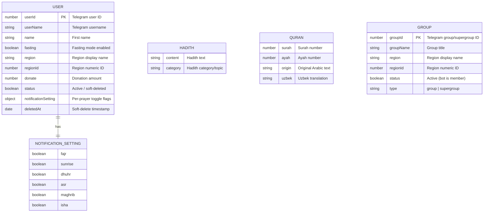

# ReminderBot — Telegram Prayer Time [Reminder Bot](https://t.me/namoz5vbot)


 


ReminderBot is a feature-rich Telegram bot that reminds users of daily Islamic prayer times. It works in both **private
chats** and **group chats**, configurable notifications, inline queries, daily Quran verses, hadith browser, Quran
references, fasting reminders, regional prayer time search, statistics tracking, and more. Built with **Node.js**,
**grammY**, **MongoDB**, and **TypeScript**.

---

## Key Features

### Private Chat

- **Region-based prayer times** — users select their region on first start.
- **Fasting mode** — customized messages for Suhoor (Fajr) and Iftar (Maghrib).
- **Configurable prayer notifications** — individually toggle alerts for Fajr, Sunrise, Dhuhr, Asr, Maghrib, and Isha.
- **Daily prayer time reminders** sent automatically every morning.
- **Friday special** — a Juma Mubarak image is sent instead of a plain text message on Fridays.
- **Daily Quran verse** — a random Quran verse (Arabic + Uzbek translation) is appended to every daily reminder.
- **Hadith browser** — browse hadiths interactively.
- **Quran & Tafsir** — access Quran verses and their commentary.
- **Regional search** — fuzzy-search prayer times by city/region name.
- **Location update** — change your region at any time.
- **Feedback** — submit suggestions or complaints directly through the bot.
- **Statistics** — view bot usage and engagement stats.
- **Source** — view the data source used for prayer times.
- **Inline query** — query prayer times from any chat without opening the bot.

### Group Chat

- **Group registration** — when the bot is added to a group, it automatically starts the region-selection flow.
- **Group region setup** (`GroupStart` scene) — admin selects the group's region via paginated inline keyboard; prayer
  times are shown immediately after selection.
- **Group location update** (`GroupLocation` scene) — change the group's region at any time using `/location`.
- **Daily group reminders** — groups receive the same daily prayer time message as private users (without
  fasting-specific content).
- **Friday Juma image** — groups also receive the Juma Mubarak photo on Fridays.
- **Auto-deactivation** — when the bot is removed from a group, the group is automatically marked inactive and stops
  receiving messages.
- **In-memory group cache** — group data is cached in memory for fast access without repeated DB queries.

---

## Architecture Overview

```
server.ts              — Bot entry point, middleware, command routing, webhook/polling setup
scenes/                — grammY scene handlers (one file per feature flow)
cron/cron.ts           — Scheduled jobs: daily reminders, prayer-time alerts (computed via adhan)
config/database.ts     — Mongoose models (User, Hadith, Quran, Group)
config/i18n.ts         — i18next internationalization setup
config/regions.json    — Static region data (coordinates, names, IDs)
config/storage.ts      — In-memory session storage (grammY MemorySessionStorage)
helper/                — Error handler, Quran verse fetcher, hadith fetcher, HTML helpers, keyboard mapper
keyboard/              — Inline and custom keyboard builders
middlewares/auth.ts    — User and group auth middleware (auto-create/load from DB or cache)
query/inline.ts        — Inline query handler
translate/             — i18n translation files (Uzbek)
types/                 — TypeScript interfaces (database models, bot context, i18next resources)
utils/                 — Constants, env validation (Zod), enums, dayjs config, prayer time computation (adhan)
```

---

## Database Design



> **Note:** Prayer times are no longer stored in the database. They are computed at runtime using the
> [adhan](https://github.com/batoulapps/adhan-js) library with region coordinates from `config/regions.json`.

---

## Scheduled Jobs (Cron)

| Schedule            | Job                      | Description                                                                                                       |
| ------------------- | ------------------------ | ----------------------------------------------------------------------------------------------------------------- |
| `0 1 * * *` (daily) | `daily()` + `reminder()` | Sends morning prayer time summaries to all active users & groups; reschedules per-prayer alerts                   |
| Per-prayer time     | `reminder()`             | Sends individual prayer-time alerts (Fajr, Sunrise, Dhuhr, Asr, Maghrib, Isha) based on each region's exact times |

---

## Bot Commands

### Private Chat

| Command         | Description                                     |
| --------------- | ----------------------------------------------- |
| `/start`        | Register and set up region & fasting preference |
| `/location`     | Change your region                              |
| `/notification` | Toggle per-prayer notifications                 |
| `/fasting`      | Toggle fasting mode                             |
| `/search`       | Search prayer times by region name              |
| `/hadith`       | Browse hadiths                                  |
| `/quran`        | Access Quran & Tafsir                           |
| `/source`       | View prayer time data source                    |
| `/statistic`    | View bot statistics                             |
| `/feedback`     | Send feedback to the team                       |

### Group Chat

| Command     | Description                           |
| ----------- | ------------------------------------- |
| `/start`    | Activate the bot in the group         |
| `/location` | Change the group's prayer time region |

---

## Installation

Ensure you have [pnpm](https://pnpm.io/) installed:

```bash
npm install -g pnpm
```

Clone the repository:

```bash
git clone https://github.com/Xayrulloh/ReminderBot.git
cd ReminderBot
```

Install dependencies:

```bash
pnpm install
```

---

## Configuration

Copy `.env.example` to `.env` and fill in the values:

```bash
cp .env.example .env
```

| Variable                                | Description                                                      |
| --------------------------------------- | ---------------------------------------------------------------- |
| `NODE_ENV`                              | `local`, `dev`, or `prod`                                        |
| `TOKEN`                                 | Telegram Bot API token from [@BotFather](https://t.me/BotFather) |
| `MONGO_URL`                             | MongoDB connection string                                        |
| `PAYME_URL` / `PAYME_ENDPOINT` / `CARD` | Payment integration (optional)                                   |
| `DISCORD_WEBHOOK_URL`                   | Discord webhook for logging                                      |
| `DISCORD_LOGS_THREAD_ID`               | Discord thread ID for general logs                               |
| `DISCORD_FLOOD_THREAD_ID`               | Discord thread ID for flood/unknown messages                     |
| `DISCORD_FEEDBACK_THREAD_ID`            | Discord thread ID for user feedback                              |
| `SESSION_TTL`                           | Session TTL in milliseconds                                      |
| `WEBHOOK_PORT`                          | Port for the Fastify webhook server                              |
| `WEBHOOK_URL`                           | Public HTTPS URL for the webhook                                 |
| `WEBHOOK_ENABLED`                       | `true` to use webhook mode, `false` for long-polling             |
| `QURON_VA_TAFSIRI_URL`                  | Quran & Tafsir API URL                                           |

---

## Usage

**Development mode** (auto-recompile on change):

```bash
pnpm run start:dev
```

**Production mode** (build then start):

```bash
pnpm run build
pnpm start
```

---

## Tech Stack

| Layer           | Technology                                                       |
| --------------- | ---------------------------------------------------------------- |
| Runtime         | Node.js 24.x                                                    |
| Language        | TypeScript 5.x                                                  |
| Bot Framework   | [grammY](https://grammy.dev/) + grammy-scenes                   |
| Database        | MongoDB via Mongoose                                             |
| Prayer Times    | [adhan](https://github.com/batoulapps/adhan-js) (coordinate-based computation) |
| i18n            | i18next                                                          |
| Scheduler       | node-cron + node-schedule                                        |
| HTTP Server     | Fastify (webhook mode)                                           |
| Logging         | Discord Webhooks (discord.js)                                    |
| Validation      | Zod                                                              |
| Linter          | Biome                                                            |
| Package Manager | pnpm 10.x                                                       |

---

## License

This project is licensed under the MIT License — see the [LICENSE.txt](LICENSE.txt) file for details.

---

> **Security Note:** Never commit your `.env` file or share your bot token publicly. Keep all secrets out of version
> control.
